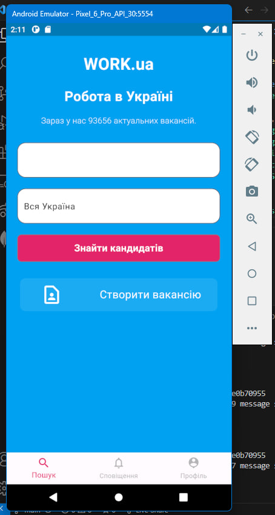
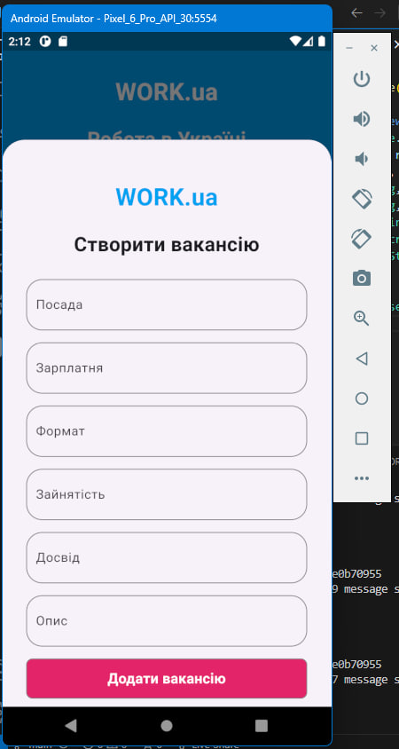
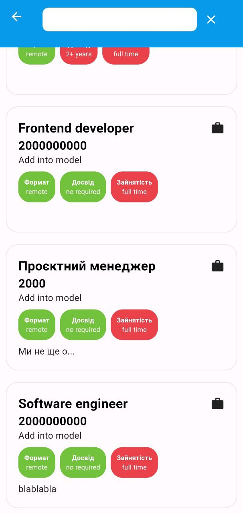
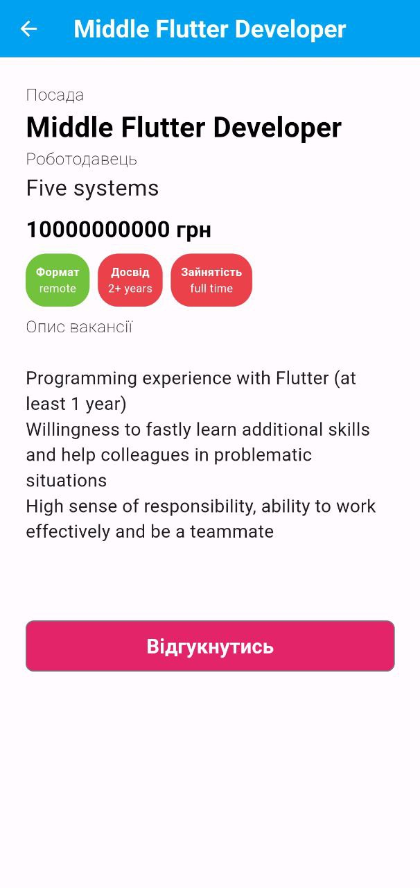
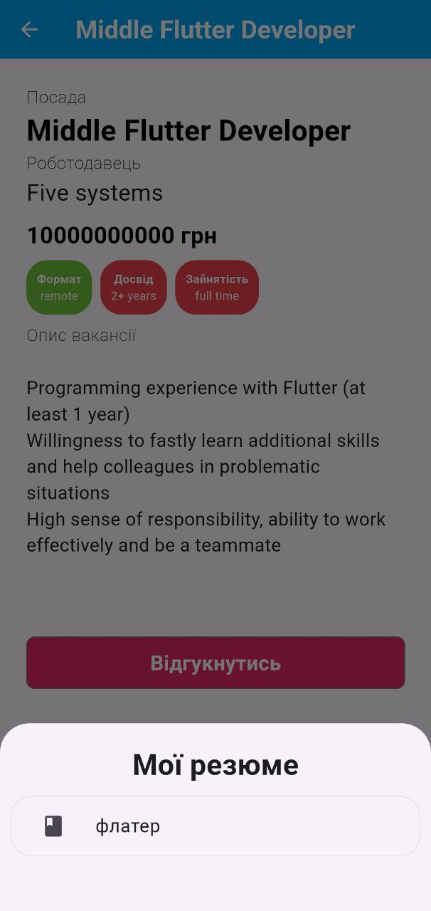
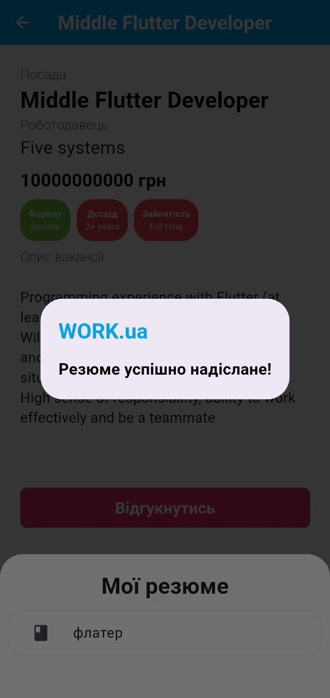
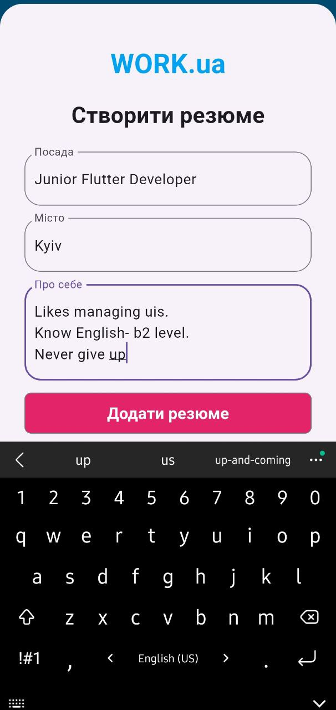
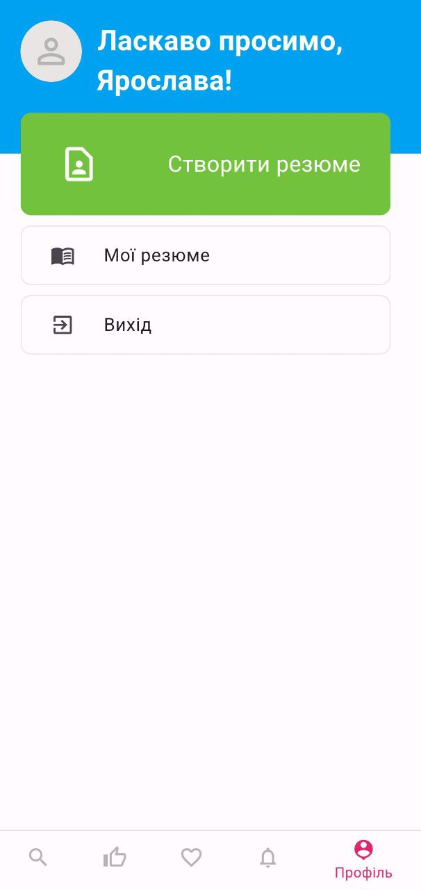
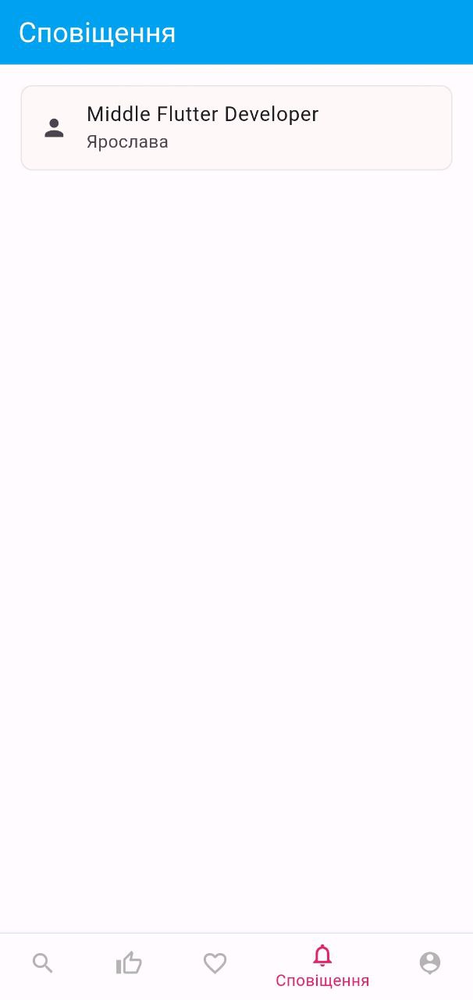
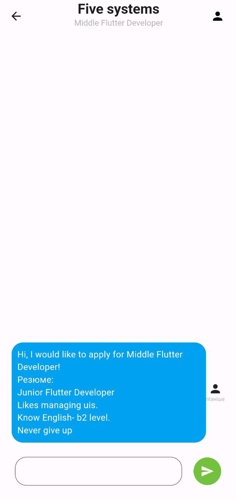

# Work.ua Clone
Work.ua - is a ukrainian service for job search. This clone is modified by implementing a real-time text chat.

## Technologies
- flutter_bloc: ^8.1.3
- intl: ^0.18.1
- dio: ^5.3.3
- meta: ^1.9.1
- equatable: ^2.0.5
- shared_preferences: ^2.2.2
- socket_io_client: ^2.0.3+1
- provider: ^6.1.1

## UI
<table>
  <tr>
    <td align="center">
      
    </td>
    <td align="center">
      
    </td>
    <td align="center">
      
    </td>
  </tr>
  <tr>
    <td align="center">
      
    </td>
     <td align="center">
      
    </td>
    <td align="center">
      
    </td>
  </tr>
  <tr>
    <td align="center">
      
    </td>
    <td align="center">
      
    </td>
    <td align="center">
      
    </td>
  </tr>
   <tr>
    <td align="center">
      
    </td>
    <td align="center">
      
    </td>
    <td align="center">
      
    </td>
  </tr>
</table>
